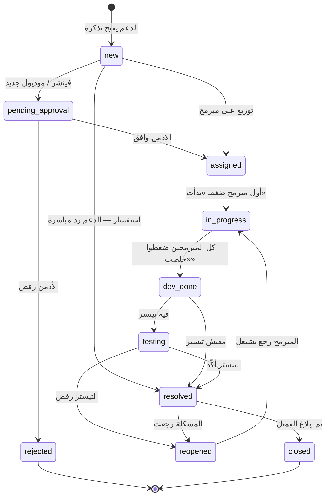
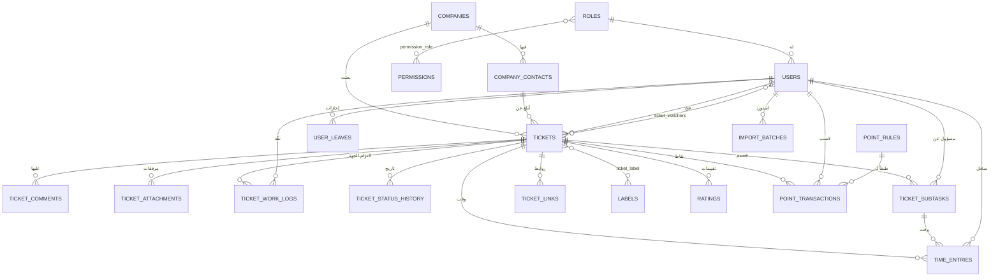

# نظام تذاكر الدعم الفني — المعمارية وخطة التنفيذ

> **الستاك:** Laravel 11 + MySQL 8 + Blade + Tailwind CSS + Alpine.js
> **اللغة:** عربي بالكامل (RTL)
> **الملفات المرتبطة:** `CLAUDE.md` (قواعد الكود) · `FEATURES.md` (كتالوج الفيتشرات) · `PROMPT.md` (برومبت البداية)

---

## 1. الفكرة الحاكمة

النظام ده **مزيج مقصود** بين حاجتين مبيتلمّوش مع بعض عادةً — وده سبب وجوده أصلاً:

| الجزء | مصدره | بيجاوب على |
|---|---|---|
| **التذكرة** | نظام دعم العملاء | مين العميل؟ إيه المشكلة؟ اتحلت امتى؟ العميل اتبلغ؟ |
| **الصب تاسك** | Jira | الشغل ده بيتقسم إزاي؟ مين ياخد إيه؟ هياخد قد إيه؟ يخلص امتى؟ |

**التذكرة = الالتزام تجاه العميل. الصب تاسك = وحدة الشغل الداخلية.**

Jira مبيعرفش مين العميل ولا الـ SLA. نظام التذاكر مبيعرفش يقسم الشغل ويقدّره. احنا محتاجين الاتنين في مكان واحد.

### الي السيستم هيعمله
1. موظف الدعم يفتح تذكرة لكل مشكلة، بوصف منسق وصور.
2. التذكرة تتوجه لمبرمج فرونت و/أو باك، وتيستر يتابع.
3. المبرمج يقسّم الشغل لصب تاسكس، كل واحدة بتاريخ وتقدير بالساعات.
4. الكاليندر بيوري مين مشغول بإيه وامتى — ومين فوق طاقته.
5. لما التذكرة تتحل، النقاط تتصرف أوتوماتيك حسب قواعد الأدمن.
6. تقارير شهرية: مين حل كام بج، رد على كام استفسار، عمل كام فيتشر، وأخد كام نقطة.
7. الشركات والمستخدمين بيتحمّلوا من شيتات Excel.

### خارج النطاق
بوابة العميل · تكامل ERP مباشر · سبرنتات · إيبكس (مستوى تالت) · تطبيق موبايل.
التفاصيل وأسبابها في `FEATURES.md` § «مؤجّل عن قصد».

---

## 2. الأدوار والصلاحيات

### الأدوار

| الدور | الكود | بيعمل إيه |
|---|---|---|
| مدير النظام | `admin` | كل حاجة + قواعد النقاط + موافقة الفيتشرات |
| مدير التيم | `manager` | يشوف الكل، يوزع، يقيّم، يشوف التقارير |
| دعم فني | `support` | يفتح تذاكر، يعلّق، يبلغ العميل |
| مبرمج فرونت | `frontend` | تاسكاته، صب تاسكس، بدأت/خلصت، تسجيل وقت |
| مبرمج باك | `backend` | نفس الحاجة |
| تيستر | `tester` | يتابع الحل، يأكد أو يرجّع |

> **المبرمج ممكن يكون فرونت وباك.** حقل `skills` على المستخدم (`frontend` / `backend` / `both` / `none`) بيحدد يظهر في أنهي قائمة توزيع — مش الدور لوحده.

### الصلاحيات (26)
```
tickets.view.all      tickets.view.assigned   tickets.view.own
tickets.create        tickets.edit            tickets.delete
tickets.assign        tickets.resolve         tickets.reopen
tickets.close         tickets.notify_client
comments.create       comments.internal       worklog.manage
subtasks.manage       time.log                links.manage
features.approve      ratings.give            ratings.view.all
points.view.all       points.view.own         points.rules.manage
reports.view          users.manage            companies.manage
settings.manage       audit.view              import.run
```

### المصفوفة الافتراضية

| الصلاحية | `admin` | `manager` | `support` | `frontend` | `backend` | `tester` |
|---|:--:|:--:|:--:|:--:|:--:|:--:|
| `tickets.view.all` | ✔ | ✔ | ✔ | — | — | — |
| `tickets.view.assigned` | ✔ | ✔ | ✔ | ✔ | ✔ | ✔ |
| `tickets.create` | ✔ | ✔ | ✔ | — | — | — |
| `tickets.assign` | ✔ | ✔ | — | — | — | — |
| `tickets.resolve` | ✔ | ✔ | ✔ | — | — | ✔ |
| `tickets.reopen` | ✔ | ✔ | — | — | — | ✔ |
| `tickets.notify_client` | ✔ | ✔ | ✔ | — | — | — |
| `comments.create` | ✔ | ✔ | ✔ | ✔ | ✔ | ✔ |
| `worklog.manage` | ✔ | — | — | ✔ | ✔ | — |
| `subtasks.manage` | ✔ | ✔ | ✔ | ✔ | ✔ | ✔ |
| `time.log` | ✔ | ✔ | ✔ | ✔ | ✔ | ✔ |
| `links.manage` | ✔ | ✔ | ✔ | ✔ | ✔ | — |
| `features.approve` | ✔ | — | — | — | — | — |
| `ratings.give` | ✔ | ✔ | — | — | — | — |
| `points.view.own` | ✔ | ✔ | ✔ | ✔ | ✔ | ✔ |
| `points.view.all` | ✔ | ✔ | — | — | — | — |
| `points.rules.manage` | ✔ | — | — | — | — | — |
| `reports.view` | ✔ | ✔ | — | — | — | — |
| `users.manage` | ✔ | — | — | — | — | — |
| `import.run` | ✔ | — | — | — | — | — |

---

## 3. دورة حياة التذكرة

### الحالات

| الحالة | الكود | المعنى |
|---|---|---|
| جديدة | `new` | اتفتحت لسه |
| بانتظار الموافقة | `pending_approval` | فيتشر مستنية الأدمن |
| مرفوضة | `rejected` | الأدمن رفض |
| موزعة | `assigned` | اتوزعت، لسه مبدأش |
| جاري العمل | `in_progress` | مبرمج واحد على الأقل ضغط «بدأت» |
| تم التطوير | `dev_done` | كل المبرمجين خلصوا |
| تحت الاختبار | `testing` | التيستر بيراجع |
| مرتجعة | `reopened` | التيستر رجّعها |
| تم الحل | `resolved` | **هنا بتتصرف النقاط** |
| مغلقة | `closed` | العميل اتبلغ |

### المسارات



### القواعد الحاكمة
1. **`in_progress` مبيتحطش يدوي** — بيتحسب من `ticket_work_logs`.
2. **`dev_done` شرطها إن كل الـ work logs بحالة `done`.**
3. **★ لو الجهة عندها صب تاسكس، الـ work log بتاعها ميتحطش `done` غير لما كل صب تاسكس الجهة دي تخلص.**
4. **النقاط تتصرف مرة واحدة** عند أول دخول لـ `resolved`.
5. **الفيتشر متتوزعش قبل موافقة الأدمن.**
6. **كل انتقال بيتسجل** في `ticket_status_history`.

---

## 4. نموذج البيانات — 25 جدول

### التقسيم بالطبقات

| الطبقة | الجداول | المرحلة |
|---|---|:--:|
| **الصلاحيات** | `roles` · `permissions` · `permission_role` · `users` | 0 |
| **العملاء** | `companies` · `company_contacts` | 1 |
| **الاستيراد** | `import_batches` | 1 |
| **التذاكر** | `tickets` · `ticket_comments` · `ticket_attachments` | 2 |
| **سير العمل** | `ticket_work_logs` · `ticket_status_history` | 3 |
| **★ طبقة Jira** | `ticket_subtasks` · `time_entries` · `ticket_links` · `labels` · `ticket_label` · `ticket_watchers` | 4 |
| **★ الكاليندر** | `holidays` · `user_leaves` | 5 |
| **النقاط** | `ratings` · `point_rules` · `point_transactions` | 6 |
| **النظام** | `settings` · `activity_logs` · `notifications` | 0 · 8 |

### مخطط العلاقات



---

### 4.1 الصلاحيات

#### `roles`
`id` · `key` UNIQUE · `name_ar` · `is_system` BOOL

#### `permissions` / `permission_role`
`permissions`: `id` · `key` UNIQUE · `group` · `name_ar`. Pivot عادي.

#### `users`
| العمود | النوع | ملاحظات |
|---|---|---|
| `id` `name` `email` UNIQUE `password` | | bcrypt |
| `role_id` | FK | |
| `skills` | ENUM | `frontend` `backend` `both` `none` |
| `daily_capacity_hours` | DECIMAL(4,2) | ★ افتراضي 6.00 |
| `must_change_password` | BOOL | ★ للمستوردين من Excel |
| `avatar_path` · `is_active` · `last_login_at` | | |

---

### 4.2 العملاء والاستيراد

#### `companies`
`id` · `name` · `code` · `is_active` · `notes` · timestamps

#### `company_contacts`
`id` · `company_id` FK · `name` · **`erp_employee_id`** VARCHAR(50) · `email` · `phone` · `is_active`
`UNIQUE(company_id, erp_employee_id)`

#### ★ `import_batches`
| العمود | النوع | ملاحظات |
|---|---|---|
| `id` `user_id` FK | | |
| `type` | ENUM | `companies` `contacts` `users` |
| `original_filename` · `stored_name` | | |
| `total_rows` · `created_rows` · `updated_rows` · `failed_rows` | INT | |
| `status` | ENUM | `pending` `validating` `previewing` `importing` `completed` `failed` |
| `errors` | JSON | صف + عمود + سبب |
| `created_at` · `completed_at` | | |

---

### 4.3 التذاكر

#### `tickets`
```
id                       BIGINT PK
ticket_number            VARCHAR(20) UNIQUE      -- TK-2026-00001
company_id               FK companies
contact_id               FK company_contacts NULL
reporter_name            VARCHAR(150)            -- لقطة ثابتة
reporter_erp_id          VARCHAR(50)             -- لقطة ثابتة
title                    VARCHAR(255)
description              LONGTEXT                -- HTML منقّى
type                     ENUM(bug, inquiry, feature, new_module, undefined)
scope                    ENUM(frontend, backend, both, inquiry, undefined)
priority                 ENUM(low, medium, high, urgent)
status                   ENUM(new, pending_approval, rejected, assigned,
                              in_progress, dev_done, testing, reopened,
                              resolved, closed)
module                   VARCHAR(100) NULL
created_by               FK users
assigned_frontend_id     FK users NULL
assigned_backend_id      FK users NULL
tester_id                FK users NULL
approval_status          ENUM(not_required, pending, approved, rejected)
approved_by              FK users NULL
approved_at              TIMESTAMP NULL
reported_at              TIMESTAMP               -- أوتو = وقت الفتح
first_response_at        TIMESTAMP NULL
sla_due_at               TIMESTAMP NULL
resolved_at              TIMESTAMP NULL
resolution_note          TEXT NULL
client_notified_at       TIMESTAMP NULL
client_notified_by       FK users NULL
closed_at                TIMESTAMP NULL
points_awarded_at        TIMESTAMP NULL          -- حارس منع الصرف المزدوج

-- ★ طبقة Jira
start_date               DATE NULL
due_date                 DATE NULL
original_estimate_hours  DECIMAL(7,2) NULL
spent_hours              DECIMAL(7,2) DEFAULT 0  -- rollup مخزّن
subtasks_total           INT DEFAULT 0           -- عدّاد مخزّن
subtasks_done            INT DEFAULT 0           -- عدّاد مخزّن

timestamps + softDeletes
```
**فهارس:** `(status, priority, created_at)` · `(company_id)` · `(assigned_frontend_id)` · `(assigned_backend_id)` · `(tester_id)` · `(created_by)` · `(type, status)` · `(due_date)` · `(sla_due_at)` · FULLTEXT `(title, description)`

#### `ticket_comments`
`id` · `ticket_id` · `user_id` · `body` LONGTEXT (منقّى) · `is_internal` · timestamps

#### `ticket_attachments`
`id` · `ticket_id` · `comment_id` NULL · `stored_name` (uuid) · `original_name` · `thumbnail_name` NULL · `mime_type` · `size_bytes` · `uploaded_by`

---

### 4.4 سير العمل

#### `ticket_work_logs` — ★ الي بيحل «فرونت وباك على نفس التذكرة»
| العمود | النوع | ملاحظات |
|---|---|---|
| `id` `ticket_id` FK `user_id` FK | | |
| `side` | ENUM | `frontend` `backend` |
| `status` | ENUM | `pending` `in_progress` `done` |
| `started_at` · `finished_at` | TIMESTAMP NULL | زراير بدأت/خلصت |
| `duration_minutes` | INT NULL | |

`UNIQUE(ticket_id, side)`

#### `ticket_status_history`
`id` · `ticket_id` · `from_status` · `to_status` · `user_id` · `note` · `created_at`

---

### 4.5 ★ طبقة Jira

#### `ticket_subtasks`
```
id                BIGINT PK
ticket_id         FK tickets            ON DELETE CASCADE
title             VARCHAR(255)
description       TEXT NULL             -- نص عادي، مش محرر
assignee_id       FK users NULL
side              ENUM(frontend, backend, qa, support, other)
status            ENUM(todo, in_progress, done, blocked)
start_date        DATE NULL
due_date          DATE NULL
estimated_hours   DECIMAL(6,2) NULL
spent_hours       DECIMAL(6,2) DEFAULT 0   -- rollup مخزّن
started_at        TIMESTAMP NULL
completed_at      TIMESTAMP NULL
blocked_reason    VARCHAR(255) NULL        -- إجباري لو status = blocked
position          INT                      -- ترتيب السحب
created_by        FK users
timestamps + softDeletes
```
**فهارس:** `(ticket_id, position)` · `(assignee_id, due_date)` · `(due_date)` · `(status)`

#### `time_entries`
```
id            BIGINT PK
ticket_id     FK
subtask_id    FK NULL
user_id       FK
hours         DECIMAL(5,2)    CHECK (hours >= 0.25 AND hours <= 24)
spent_on      DATE            -- مينفعش في المستقبل
note          VARCHAR(255) NULL
created_at
```
**فهارس:** `(user_id, spent_on)` · `(ticket_id)` · `(subtask_id)`

#### `ticket_links`
`id` · `from_ticket_id` FK · `to_ticket_id` FK · `type` ENUM(`blocks`, `relates`, `duplicates`, `caused_by`) · `created_by` · `created_at`
`UNIQUE(from_ticket_id, to_ticket_id, type)` · `CHECK (from_ticket_id != to_ticket_id)`

> بيتخزن **اتجاه واحد**، والعرض بيوضح الاتجاهين (`blocks` ↔ `blocked_by`).

#### `labels` / `ticket_label`
`labels`: `id` · `name` · `color` · `created_by`. Pivot عادي.

#### `ticket_watchers`
`ticket_id` · `user_id` · `created_at` — `UNIQUE(ticket_id, user_id)`

---

### 4.6 ★ الكاليندر

#### `holidays`
`id` · `date` · `name` · `is_recurring` BOOL

#### `user_leaves`
`id` · `user_id` FK · `start_date` · `end_date` · `type` ENUM(`annual`, `sick`, `other`) · `note` · `approved_by` FK NULL

---

### 4.7 النقاط

#### `ratings`
`id` · `ticket_id` · `ratee_id` FK users · `side` ENUM(`support`,`frontend`,`backend`,`tester`) · `score` TINYINT CHECK(1..10) · `comment` · `rated_by` · `rated_at`
`UNIQUE(ticket_id, ratee_id, side)`

#### `point_rules`
`id` · `ticket_type` ENUM · `scope` ENUM(`frontend`,`backend`,`both`,`any`) · `side` ENUM · `points` DECIMAL(5,2) · `is_active` · `updated_by`
`UNIQUE(ticket_type, scope, side)`

#### `point_transactions` — دفتر أستاذ ثابت
`id` · `user_id` · `ticket_id` · `side` · `points` DECIMAL(5,2) · `rule_id` NULL · `period` CHAR(7) · `reason` · `created_at`
**`UNIQUE(ticket_id, user_id, side)`** ← ضمان قاطع ضد الصرف المزدوج

---

### 4.8 النظام
- `settings` — `key` UNIQUE · `value` · `type`
- `activity_logs` — `user_id` · `action` · `subject_type` · `subject_id` · `changes` JSON · `ip` · `user_agent` · `created_at`
- `notifications` — Laravel القياسي

---

## 5. محرك النقاط

### القواعد الافتراضية
| النوع | النطاق | دعم | فرونت | باك | تيستر |
|---|---|:--:|:--:|:--:|:--:|
| استفسار | `any` | 1 | — | — | — |
| بج | `frontend` | 1 | 1 | — | 0.5 |
| بج | `backend` | 1 | — | 1 | 0.5 |
| بج | `both` | 1 | 1 | 1 | 0.5 |
| فيتشر | `frontend` | 1 | 2 | — | 0.5 |
| فيتشر | `backend` | 1 | — | 2 | 0.5 |
| فيتشر | `both` | 1 | 2 | 2 | 0.5 |
| موديول جديد | `any` | 1 | 3 | 3 | 1 |

### الخوارزمية
```
1. points_awarded_at != null           → توقف
2. feature/module و !approved          → توقف
3. المشاركين: created_by · assigned_frontend_id · assigned_backend_id · tester_id
4. لكل واحد:
     a. القاعدة (type, scope, side) → fallback (type, 'any', side)
        → مفيش؟ صفر + Log::warning
     b. is_active = false → تخطى
     c. point_transactions بـ period = resolved_at->format('Y-m')
5. points_awarded_at = now()
```
كلها جوه `DB::transaction`.

### نقاط دقة
- تعديل القاعدة **مبيأثرش بأثر رجعي**.
- `period` من **`resolved_at`** مش `now()`.
- نفس الشخص فرونت وباك → **سطرين منفصلين**. مقصود.
- الـ ledger **immutable** — التصحيح سطر جديد بنقاط سالبة.
- **★ تسجيل الوقت مالوش علاقة بالنقاط** — عشان محدش يزوّد ساعات علشان النقط.

---

## 6. الشاشات — 22

| # | الشاشة | المسار | الصلاحية | مرحلة |
|---|---|---|---|:--:|
| 1 | تسجيل الدخول | `/login` | — | 0 |
| 2 | ★ **اليوم** (الرئيسية) | `/` | مسجّل | 7 |
| 3 | كل التذاكر | `/tickets` | `tickets.view.all` | 2 |
| 4 | فتح تذكرة | `/tickets/create` | `tickets.create` | 2 |
| 5 | تفاصيل التذكرة | `/tickets/{ticket}` | Policy | 2 |
| 6 | بوردي | `/my-board` | `worklog.manage` | 3 |
| 7 | بورد التيم | `/board` | `tickets.view.all` | 4 |
| 8 | ★ كاليندري | `/calendar/me` | مسجّل | 5 |
| 9 | ★ كاليندر التيم | `/calendar/team` | `reports.view` | 5 |
| 10 | ★ ورقة وقتي | `/my-timesheet` | `time.log` | 4 |
| 11 | طابور التيست | `/testing-queue` | tester | 3 |
| 12 | طابور الموافقات | `/approvals` | `features.approve` | 3 |
| 13 | ملف الموظف | `/employees/{user}` | `reports.view` | 7 |
| 14 | لوحة الصدارة | `/leaderboard` | `points.view.all` | 7 |
| 15 | التقارير | `/reports` | `reports.view` | 7 |
| 16 | الشركات | `/admin/companies` | `companies.manage` | 1 |
| 17 | ★ الاستيراد | `/admin/import` | `import.run` | 1 |
| 18 | المستخدمين | `/admin/users` | `users.manage` | 1 |
| 19 | الأدوار | `/admin/roles` | `users.manage` | 0 |
| 20 | مصفوفة النقاط | `/admin/point-rules` | `points.rules.manage` | 6 |
| 21 | الإعدادات | `/admin/settings` | `settings.manage` | 0 |
| 22 | سجل النشاط | `/admin/audit` | `audit.view` | 8 |

> تفاصيل سلوك كل شاشة ومعايير قبولها في `FEATURES.md`.

---

## 7. الأمان

القائمة الكاملة في `CLAUDE.md` § 5. **أخطر 4 نقط:**

| # | الخطر | الدفاع |
|---|---|---|
| 1 | **XSS من المحرر** | `Purifier::clean()` على السيرفر · whitelist ضيق · ممنوع `{!! !!}` على محتوى مستخدم |
| 2 | **رفع ملف خبيث** | `finfo` للـ MIME · تخزين بره `public/` · اسم uuid · إعادة معالجة الصور |
| 3 | **IDOR** | Policy لكل موديل · ممنوع `find()` من غير `authorize()` · query scopes حسب الدور |
| 4 | **★ حقن الصيغ في Excel** | تنظيف `=` `+` `-` `@` في الاستيراد **والتصدير** · ممنوع استيراد كلمات سر |

---

## 8. المعمارية

```
jira/
├── app/
│   ├── Enums/                    TicketStatus, TicketType, TicketScope, Priority,
│   │                             WorkSide, SubtaskStatus, LinkType, ImportType
│   ├── Http/
│   │   ├── Controllers/          Ticket, Subtask, TimeEntry, Board, Calendar,
│   │   │                         Report, Import, Admin\*, Auth, Install
│   │   ├── Middleware/           EnsureInstalled, CheckPermission,
│   │   │                         SecurityHeaders, ForcePasswordChange
│   │   └── Requests/             Form Request لكل POST/PUT
│   ├── Imports/                  ★ CompaniesImport, ContactsImport, UsersImport
│   ├── Exports/                  ★ TicketsExport, PointsExport, TimesheetExport
│   ├── Models/                   25 موديل
│   ├── Policies/                 TicketPolicy, SubtaskPolicy, RatingPolicy, ...
│   └── Services/                 ← كل منطق الأعمال
│       ├── TicketWorkflowService.php    الانتقالات + القواعد
│       ├── SubtaskService.php           ★ الصب تاسكس + العدّادات
│       ├── TimeTrackingService.php      ★ تسجيل الوقت + rollups
│       ├── CalendarService.php          ★ تجميع الكاليندر + السعة
│       ├── ImportService.php            ★ التحقق + المعاينة + الاستيراد
│       ├── PointEngineService.php       صرف النقاط
│       ├── SlaService.php               ★ حساب SLA بساعات العمل
│       ├── AttachmentService.php        الرفع الآمن
│       └── ReportService.php            الاستعلامات التجميعية
├── database/
│   ├── migrations/               migration لكل جدول
│   └── seeders/                  Role, Permission, PointRule, Setting, Demo
├── resources/
│   ├── css/                      ← مقسّم — شوف CLAUDE.md § 3
│   ├── js/                       app.js · features/board.js · features/calendar.js
│   └── views/
│       ├── layouts/ components/ partials/
│       └── tickets/ board/ calendar/ admin/ reports/ install/
├── storage/app/private/tickets/
└── routes/web.php
```

### قرارات معمارية

| القرار | الاختيار | ليه |
|---|---|---|
| الواجهة | Blade + Alpine | مفيش SPA. سريع للتطوير والصيانة. |
| الستايل | Tailwind **للتوكنز والمكونات بس** | الستايل الحقيقي في ملفات CSS مستقلة. شوف `CLAUDE.md` § 3. |
| المحرر | Quill أو TipTap | خفيف، RTL كويس |
| الكاليندر | **CSS Grid يدوي** | مكتبة كاليندر = 200KB لحاجة نقدر نعملها |
| الصلاحيات | جداول + Gates | من غير باكدج خارجي |
| منطق العمل | Service classes | الكونترولر نحيف |
| الوقت | UTC في الـ DB | العرض بتوقيت القاهرة |
| Vite | entries منفصلة للبورد والكاليندر | متحمّلش SortableJS على صفحة الدخول |

---

## 9. معالج التنصيب

5 خطوات على `/install`: فحص المتطلبات → بيانات الداتابيز (بتتعمل لو مش موجودة) → migrations + seeders → حساب الأدمن → كتابة `.env` + `APP_KEY` + `installed.lock`.

**الحراسة:** `EnsureInstalled` بيحوّل لـ `/install` لو الملف مش موجود، وبيرجع **404** عليه لو موجود.

**التسليم:** `zip` فيه المشروع + `vendor/` + الأصول مبنية.

---

## 10. التصميم

المرجع الكامل في `CLAUDE.md` § 6. **الأطروحة:**

> **كل بكسل ملون بيعني حاجة. مفيش لون زخرفي.**

والصفحة الرئيسية **«اليوم»** — مش لوحة أرقام. الأرقام مكانها `/reports` بتروحلها بقصد.

---

## 11. خطة التنفيذ — 9 مراحل

| # | المرحلة | الفيتشرات | المحصلة |
|:--:|---|---|---|
| **0** | الأساس | `F00` `F22.2` | تقدر تنصّب، تدخل، وتشوف صفحة مصممة |
| **1** | العملاء والاستيراد | `F01` `F02` `F22.3` | **بيانات حقيقية في السيستم من شيتاتك** |
| **2** | التذاكر | `F03` `F04` `F05` | ★ **أقل منتج قابل للاستخدام** |
| **3** | سير العمل | `F06` `F07` `F12.1` `F15` `F16` | ★ **التيم كله شغال** |
| **4** | طبقة Jira | `F08` `F09` `F10` `F11` `F12.2` `F20` | ★ **بقى Jira مش تذاكر بس** |
| **5** | الكاليندر | `F13` `F14` | تخطيط بصري + سعة حقيقية |
| **6** | النقاط | `F17` `F18` | النقاط بتتجمع أوتوماتيك |
| **7** | التقارير | `F19` `F21` `F22.1` | تقرير المكافآت بضغطة |
| **8** | التشديد | `F23` + مراجعة أمنية + zip | التسليم |

### ليه الترتيب ده

- **الاستيراد قبل التذاكر** — عشان تجرب على بيانات حقيقية من أول يوم، مش على `Test User 1`.
- **سير العمل قبل طبقة Jira** — التذكرة لازم تمشي صح قبل ما نقسمها.
- **الكاليندر بعد الصب تاسكس** — الكاليندر بيقرأ من الصب تاسكس، من غيرها فاضي.
- **النقاط بعد كل ده** — النقاط بتتصرف عند `resolved`، ومحتاجة سير عمل كامل يشتغل الأول.

### تفصيل المراحل

**0 — الأساس**
Laravel + Tailwind + Alpine · معالج التنصيب · المصادقة والأدوار والصلاحيات · القالب RTL + التوكنز + المكونات الأساسية · Middleware الأمان + Purifier · شاشة الإعدادات.

**1 — العملاء والاستيراد**
الشركات وجهات الاتصال مع `erp_employee_id` · إدارة المستخدمين · **استيراد Excel** للتلاتة (قالب → رفع → تحقق → معاينة → تأكيد → تقرير).

**2 — التذاكر**
فتح تذكرة بمحرر ورفع صور متعدد · تفاصيل التذكرة · التعليقات والخط الزمني · معرض الصور · الرفع الآمن + راوت التحميل المحمي · قائمة التذاكر بالفلاتر والعمر وزمن الحل.

**3 — سير العمل**
التوزيع · `ticket_work_logs` وزراير بدأت/خلصت · State machine + التاريخ · طابور الموافقات · طابور التيست · «تم إبلاغ العميل» · **بوردي**.

**4 — ★ طبقة Jira**
الصب تاسكس بتواريخ وتقديرات · تسجيل الوقت + rollups · ورقة الوقت · ربط التذاكر · اللابلز والمتابعين · بورد التيم · الإشعارات.

**5 — ★ الكاليندر**
شهر/أسبوع/يوم/timeline · السحب لتغيير الموعد · العطلات والإجازات · مؤشر السعة · SLA بساعات العمل.

**6 — النقاط**
مصفوفة النقاط · `PointEngineService` · التقييمات 1..10 · «نقاطي».

**7 — التقارير**
صفحة **«اليوم»** · ملف الموظف · لوحة الصدارة · باقي التقارير + تصدير Excel · البحث العالمي.

**8 — التشديد والتسليم**
سجل التدقيق · مراجعة أمنية كاملة · Seeder ببيانات واقعية · تحسين الاستعلامات (N+1، فهارس) · التوثيق · **zip**.

---

## 12. قرارات محتاجة رأيك

| # | القرار | اقتراحي |
|---|---|---|
| 1 | مين ليه حق التقييم؟ | دور `manager` مستقل |
| 2 | التيستر ياخد نقاط؟ | آه، 0.5 |
| 3 | الدعم يشوف كل التذاكر؟ | آه — عشان ميفتحش تذكرة مكررة |
| 4 | التقييم إجباري قبل الإغلاق؟ | لأ — اختياري |
| 5 | ساعات SLA؟ | عاجل 4س / مرتفع 24س / متوسط 72س / منخفض 7 أيام |
| 6 | النقاط عند `resolved` ولا `closed`؟ | `resolved` |
| 7 | حجم التيم؟ | يحدد لو محتاجين queue |
| 8 | ★ الصب تاسك إجبارية ولا اختيارية؟ | **اختيارية** — الإجبار هيخلي الناس تكتب «اعمل التاسك» وخلاص |
| 9 | ★ تسجيل الوقت إجباري؟ | **لأ** — الإجبار بيولّد أرقام مزوّرة |
| 10 | ★ السعة اليومية؟ | 6 ساعات إنتاجية (مش 8) |
| 11 | ★ الإجازات والعطلات (`F14`) دلوقتي ولا بعدين؟ | دلوقتي — الكاليندر من غيرها بيكدب |

---

## الخلاصة

- **25 جدول** مقسّمة على **9 مراحل** — مش كلها مرة واحدة.
- **أخطر تفصيلة معمارية:** العلاقة بين `ticket_work_logs` و `ticket_subtasks`.
  الـ work log = **قرار** بيحرّك الحالة والنقاط · الصب تاسك = **تخطيط** بيغذّي الكاليندر والتقدير.
  القاعدة الرابطة: لو الجهة عندها صب تاسكس، مبتقدرش تقول «خلصت» غير لما كلها تخلص.
- **المرحلة 2 لوحدها بتديك منتج قابل للاستخدام.** المرحلة 4 هي الي بتحوّله من نظام تذاكر لـ Jira.
- **11 قرار** محتاج رأيك — 4 منهم جداد من طبقة Jira.
